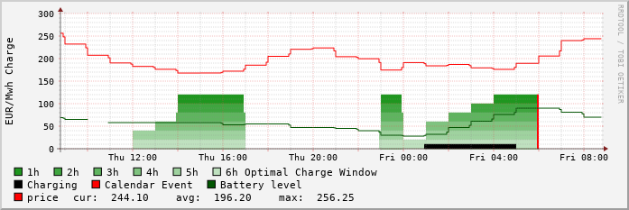
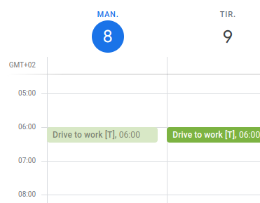

# tesla-cron

Sorry for the minimalistic documentation - to be improved some day.  

## What?



tesla-cron is a linux cron job which runs each hour and starts charging of your tesla when prices are cheapest before your next calendar event.

- Can be configured with google calendar/ical links to ensure tesla is charged before next calender event with a "[T]" tag in the title.
- Tesla Cron set the car's "Precontitioning" and "scheduled charging" to match the next calendar event. This ensures the Tesla will charge even if Tesla Cron or the car goes offline.
- Tesla Cron will not overrule and stop charging if you start charging manually, so you can still use the Tesla App as before to eg start charging manually.
- Currently works in area DK1/DK2/SE3/SE3/NO2 (Denmark/Sweden/Norway)
- Tesla is only woken up when charging is possibly started.
- Tesla Cron automatically uses prices from the correct area, based on the car's location.
- Supports carnot.dk, which tries to predict future prices beyond the known next day prices (for DK1 & DK2 area) for even better charge start estimation.

## How

Tested on Ubuntu 20.04 LTS.

### Prerequisites

With Tesla's new Vehicle Command SDK, which is now required, you will need a domain configured with TSL to be able to send commands to your Tesla. The tesla-http-proxy is currently the recommended way to use this. More info on getting this setup here: [https://github.com/teslamotors/vehicle-command](https://github.com/teslamotors/vehicle-command). Once this is working, place the tesla-http-proxy in the path and tesla-cron will automatically start and stop this proxy.

These are the prerequisites needed to build tesla-cron:
```
$sudo apt install build-essential libboost-all-dev libcurlpp-dev libcurl4-openssl-dev rapidjson-dev python3-pip librrd-dev
$sudo python3 -m pip install teslapy reverse_geocoder
```

### Configuring
Currently the configuration is hardcoded in config.inc. Edit this file to match your account. The configuration supports one tesla account with multiple cars each with multiple accosiated calendars. You need to use the private ical address for tesla-cron to be able to read the calendar titles.

Generate an access token. Use the auth.sh script to generate and store it:
```
$./auth.sh
```
### Carnot
If you want to use carnot for future price predictions, create an account at carnot.dk to generate an apikey. Add this apikey co config.inc. Carnot will try to predict prices about a weak ahead. Without Carnot, future prices are known for only about a day ahead.

### Building & testing

Update submodule dependencies (if you have not cloned recursiveliy):
```
$git submodule update --init --recursive
```

Build
```
$make
```

To test, just execute tesla-cron. Output should be similar to this:
```
$./tesla_cron
Spot prices:
2022-02-21 22:00:00.000000000 CET: 21.79
2022-02-21 23:00:00.000000000 CET: 16.16
2022-02-22 00:00:00.000000000 CET: 35.02
2022-02-22 01:00:00.000000000 CET: 30.04
2022-02-22 02:00:00.000000000 CET: 33.93
2022-02-22 03:00:00.000000000 CET: 50.01
2022-02-22 04:00:00.000000000 CET: 56.03
2022-02-22 05:00:00.000000000 CET: 90.71
2022-02-22 06:00:00.000000000 CET: 117.86
2022-02-22 07:00:00.000000000 CET: 185.78
2022-02-22 08:00:00.000000000 CET: 211.59
2022-02-22 09:00:00.000000000 CET: 180.27
2022-02-22 10:00:00.000000000 CET: 144.08
2022-02-22 11:00:00.000000000 CET: 135.04
2022-02-22 12:00:00.000000000 CET: 121.25
2022-02-22 13:00:00.000000000 CET: 117.66
2022-02-22 14:00:00.000000000 CET: 118.87
2022-02-22 15:00:00.000000000 CET: 125.29
2022-02-22 16:00:00.000000000 CET: 136.7
2022-02-22 17:00:00.000000000 CET: 155.21
2022-02-22 18:00:00.000000000 CET: 162.62
2022-02-22 19:00:00.000000000 CET: 135.49
2022-02-22 20:00:00.000000000 CET: 108.62
2022-02-22 21:00:00.000000000 CET: 100.54
2022-02-22 22:00:00.000000000 CET: 99.99
2022-02-22 23:00:00.000000000 CET: 85.08
min: 16.16  max: 211.59

--- 5YJ3E7EXXXXXXXXXX ---
Upcoming events:
  2022/02/22 06:00 Europe/Copenhagen Tesla morgenklar [T]
  2022/02/23 06:00 Europe/Copenhagen Tesla morgenklar [T]
Next event: 2022-02-22 06:00:00.000000000 CET

Cheapest 1h seq: 2022-02-21 23:00:00.000000000 CET
Cheapest 2h seq: 2022-02-21 22:00:00.000000000 CET
Cheapest 3h seq: 2022-02-21 22:00:00.000000000 CET
Cheapest 4h seq: 2022-02-21 22:00:00.000000000 CET
Cheapest 5h seq: 2022-02-21 22:00:00.000000000 CET
Cheapest 6h seq: 2022-02-21 22:00:00.000000000 CET
Potential start: 2022-02-21 22:00:00.000000000 CET

Wake up tesla...
vin:      5YJ3E7EXXXXXXXXXX
limit:    90
level:    43
state:    Stopped
Charge hours: 3
Cheapest 3h seq: 2022-02-21 22:00:00.000000000 CET
Start charge now
```

### Installing
```
$sudo make install
```

tesla-cron now runs at start of each hour.

### Graphs
Tesla Cron generates rrdtool data in /var/tmp/. This can be used to generate graphs like the one shown on top of this page. A script is provided for this:
```
$./graph.sh
```
If you want the graphs to be shown on a web page, there is a doc/web_example.cgi file as an example which can be used as a template for this.
